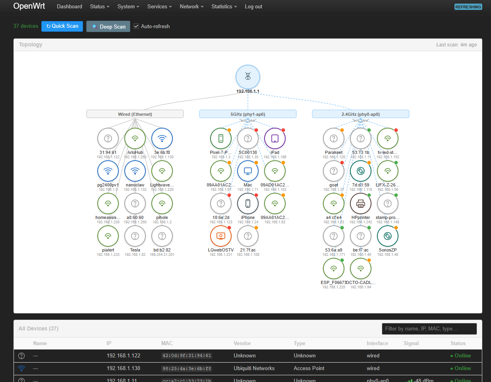

# luci-app-netmap

A visual network topology dashboard for OpenWrt. Scans your home network, identifies every device by type, and renders an interactive SVG map grouped by interface (wired, 2.4 GHz, 5 GHz).



## Features

### Topology map
- **Automatic discovery** — ARP sweep + nmap ping scan finds all reachable devices
- **Device classification** — MAC OUI lookup, hostname pattern matching, and nmap OS fingerprinting combine to identify phones, tablets, TVs, speakers, printers, IoT devices, APs, and more
- **Interactive SVG map** — devices grouped under their interface/radio, nodes are draggable with positions saved across sessions
- **Device detail panel** — click any device node to see signal, TX/RX rates, TX failed/retries, inactive time, latency, OS guess, first/last seen
- **Custom name and type** — rename any device and override its auto-detected type; changes persist across rescans and sync as static DHCP leases (MAC + IP + name)

### Interface group cards
- **Channel utilisation bars** — each wifi group card shows a colour-coded busy% bar (green/yellow/red), TX airtime overlay, and noise floor in dBm
- **SSID and channel** — displayed on each radio group card

### Router health card
- Full-width card at the top showing: **Uptime**, **CPU load**, **Memory %**, **WAN latency** (ping to 8.8.8.8), **Device count**
- Values colour-coded green/yellow/red by threshold

### Device table
- Filterable, sortable list below the map
- Columns: icon, Name, IP, MAC, Interface, Signal, TX Failed %, Status
- TX Failed % computed as `tx_failed / (tx_failed + tx_retries)`

### Scan engine
- **Quick and deep scan modes** — quick (ARP + wireless + health) runs every 5 min; deep (adds nmap OS fingerprinting) runs at :15 and :45 past each hour
- **Ping latency** — one ping per discovered host, parallel, displayed as colour-coded badge
- **Persistent history** — first-seen timestamps, custom names, and custom types survive rescans and firmware upgrades

### Reliability
- **Firmware upgrade survival** — all files listed in `/lib/upgrade/keep.d/luci-app-netmap`; custom device data in `/etc/netmap/` preserved by "Keep settings"
- **~880-entry OUI database** — covers Apple, Samsung, Google, Amazon, Nest, Sonos, TP-Link, Ubiquiti, MikroTik, Espressif, Raspberry Pi, HP, Canon, and more

## Requirements

- OpenWrt 25.12 or later (ucode-based LuCI architecture)
- Packages: `luci-base`, `iw`, `nmap`, `ip-full`

## Installation

No package feed yet — deploy directly over SSH:

```sh
R="ssh -i ~/.ssh/id_rsa root@192.168.1.1"   # adjust key/address as needed

$R "mkdir -p /usr/share/netmap /usr/share/rpcd/ucode /usr/share/rpcd/acl.d \
    /usr/share/luci/menu.d /www/luci-static/resources/view/netmap \
    /etc/netmap /lib/upgrade/keep.d"

$R "cat > /usr/bin/netmap-scan"           < files/netmap.scan
$R "cat > /usr/share/netmap/assemble.uc"  < files/netmap-assemble.uc
$R "cat > /usr/share/netmap/oui.db"       < files/oui.db
$R "cat > /etc/init.d/netmap"             < files/netmap.init

$R "cat > /usr/share/rpcd/ucode/luci.netmap"           < luci/rpcd/luci.netmap
$R "cat > /usr/share/rpcd/acl.d/luci-app-netmap.json"  < luci/acl.d/luci-app-netmap.json
$R "cat > /usr/share/luci/menu.d/luci-app-netmap.json" < luci/menu.d/luci-app-netmap.json

$R "cat > /www/luci-static/resources/view/netmap/netmap.js" \
    < www/resources/view/netmap/netmap.js

$R "chmod +x /usr/bin/netmap-scan /etc/init.d/netmap"
$R "/etc/init.d/netmap enable && /etc/init.d/netmap start"
$R "/etc/init.d/rpcd restart && /etc/init.d/uhttpd restart"
```

Then open **Network → Network Map** in LuCI.

## Uninstallation

```sh
R="ssh -i ~/.ssh/id_rsa root@192.168.1.1"   # adjust key/address as needed

$R "/etc/init.d/netmap stop; /etc/init.d/netmap disable"

$R "rm -f /usr/bin/netmap-scan \
    /usr/share/netmap/assemble.uc \
    /usr/share/netmap/oui.db \
    /etc/init.d/netmap \
    /usr/share/rpcd/ucode/luci.netmap \
    /usr/share/rpcd/acl.d/luci-app-netmap.json \
    /usr/share/luci/menu.d/luci-app-netmap.json \
    /www/luci-static/resources/view/netmap/netmap.js \
    /lib/upgrade/keep.d/luci-app-netmap"

$R "rmdir /usr/share/netmap /www/luci-static/resources/view/netmap 2>/dev/null; true"
$R "/etc/init.d/rpcd restart && /etc/init.d/uhttpd restart"
```

To also remove saved device history and custom names:

```sh
$R "rm -rf /etc/netmap"
```

## Project structure

```
luci-app-netmap/
├── files/
│   ├── netmap.scan          # Shell scan script  → /usr/bin/netmap-scan
│   ├── netmap-assemble.uc   # ucode JSON assembler → /usr/share/netmap/assemble.uc
│   ├── netmap.init          # procd init + cron  → /etc/init.d/netmap
│   └── oui.db               # MAC OUI database   → /usr/share/netmap/oui.db
├── luci/
│   ├── rpcd/luci.netmap     # ubus RPC handler   → /usr/share/rpcd/ucode/luci.netmap
│   ├── acl.d/               # rpcd ACL           → /usr/share/rpcd/acl.d/
│   └── menu.d/              # LuCI menu entry    → /usr/share/luci/menu.d/
└── www/
    └── resources/view/netmap/netmap.js  → /www/luci-static/resources/view/netmap/
```

## Scan modes

| Mode | Schedule | What it does |
|------|----------|--------------|
| `quick` | Every 5 min | ARP sweep · wireless station dump · channel survey · ping latency · system health |
| `deep` | :15 and :45 past each hour | All of quick + nmap OS fingerprinting (`-O --osscan-guess`) |
| Manual | LuCI button | Either mode on demand |

## Device types

`phone_apple` · `phone_android` · `tablet` · `computer` · `tv` · `streaming` · `speaker` · `printer` · `gaming` · `nas` · `iot` · `ap` · `powerline` · `unknown`

Classification priority: custom override → hostname pattern → OUI device-type hint → nmap OS string.

## License

GPL-2.0
